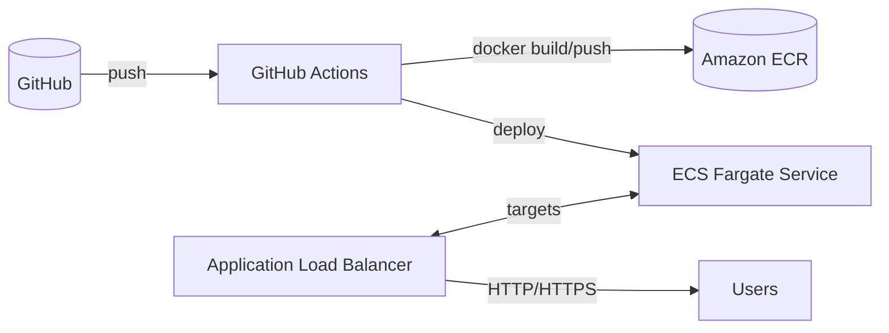

# 2048 Game CI/CD Pipeline 🛠

End-to-end CI/CD to build, test, and deploy a Dockerized 2048 web game to AWS ECS Fargate with GitHub Actions and Terraform (optional). This guide includes architecture, IaC snippets, a sample Dockerfile, and a production‑ready workflow.

## Architecture



Key points:
- Immutable images stored in ECR
- ECS Fargate (serverless containers) behind an ALB
- Zero-downtime deploys by updating the service task definition
- CloudWatch Logs for container logs; optional alarms

## What You’ll Build
- Docker image for a static 2048 game (served by NGINX)
- ECR repository to store images
- ECS (Fargate) cluster, task definition, and service behind an ALB
- GitHub Actions pipeline that builds, scans, pushes, and deploys automatically

## Repo Layout (suggested)
- `2048/` — game app and Dockerfile (static assets served by NGINX)
- `infra/` — Terraform for VPC, ALB, ECS, ECR, IAM (optional but recommended)
- `.github/workflows/2048-deploy.yaml` — CI/CD workflow

## Sample Dockerfile (NGINX)
Place this at `2048/Dockerfile` and put the game static files in `2048/www`.

```Dockerfile
FROM nginx:1.27-alpine
COPY www /usr/share/nginx/html
# Optional security hardening
RUN rm -f /etc/nginx/conf.d/default.conf \
  && printf '%s\n' \
  'server {' \
  '  listen 80;' \
  '  server_name _;' \
  '  add_header X-Content-Type-Options "nosniff" always;' \
  '  add_header X-Frame-Options "DENY" always;' \
  '  add_header X-XSS-Protection "1; mode=block" always;' \
  '  location / {' \
  '    root /usr/share/nginx/html;' \
  '    try_files $uri /index.html;' \
  '  }' \
  '}' > /etc/nginx/conf.d/2048.conf
EXPOSE 80
HEALTHCHECK --interval=30s --timeout=3s --retries=3 CMD wget -qO- http://127.0.0.1/ || exit 1
```

Tip: Use any popular open‑source 2048 static site (e.g., fork of gabrielecirulli/2048) and copy its `index.html` and assets into `2048/www`.

## Terraform (optional) — Core Snippets
These are minimal snippets; wire them into your own modules and VPC.

ECR repository:
```hcl
resource "aws_ecr_repository" "game" {
  name                 = "game-2048"
  image_tag_mutability = "MUTABLE"
  image_scanning_configuration { scan_on_push = true }
}
```

ECS cluster and log group:
```hcl
resource "aws_ecs_cluster" "main" { name = "game-2048" }
resource "aws_cloudwatch_log_group" "app" { name = "/ecs/game-2048" retention_in_days = 14 }
```

Task execution role (for pulling from ECR + logs):
```hcl
data "aws_iam_policy_document" "ecs_exec_assume" {
  statement { effect = "Allow" actions = ["sts:AssumeRole"] principals { type = "Service" identifiers = ["ecs-tasks.amazonaws.com"] } }
}

resource "aws_iam_role" "exec" { name = "game-2048-exec" assume_role_policy = data.aws_iam_policy_document.ecs_exec_assume.json }

resource "aws_iam_role_policy_attachment" "exec_ecr" {
  role       = aws_iam_role.exec.name
  policy_arn = "arn:aws:iam::aws:policy/service-role/AmazonECSTaskExecutionRolePolicy"
}
```

Task definition (NGINX container):
```hcl
resource "aws_ecs_task_definition" "web" {
  family                   = "game-2048"
  network_mode             = "awsvpc"
  requires_compatibilities = ["FARGATE"]
  cpu                      = 256
  memory                   = 512
  execution_role_arn       = aws_iam_role.exec.arn
  runtime_platform { operating_system_family = "LINUX" cpu_architecture = "X86_64" }
  container_definitions = jsonencode([
    {
      name      = "web"
      image     = "${aws_ecr_repository.game.repository_url}:latest"
      essential = true
      portMappings = [{ containerPort = 80, protocol = "tcp" }]
      logConfiguration = {
        logDriver = "awslogs"
        options = { awslogs-group = aws_cloudwatch_log_group.app.name, awslogs-region = var.region, awslogs-stream-prefix = "ecs" }
      }
    }
  ])
}
```

ALB + target group + listener (attach to ECS service):
```hcl
resource "aws_lb" "this" { name = "game-2048" internal = false load_balancer_type = "application" subnets = var.public_subnets }
resource "aws_lb_target_group" "this" { name = "tg-2048" port = 80 protocol = "HTTP" vpc_id = var.vpc_id target_type = "ip" }
resource "aws_lb_listener" "http" { load_balancer_arn = aws_lb.this.arn port = 80 protocol = "HTTP" default_action { type = "forward" target_group_arn = aws_lb_target_group.this.arn } }
```

ECS service (Fargate):
```hcl
resource "aws_ecs_service" "web" {
  name            = "game-2048"
  cluster         = aws_ecs_cluster.main.id
  task_definition = aws_ecs_task_definition.web.arn
  desired_count   = 2
  launch_type     = "FARGATE"
  network_configuration { subnets = var.private_subnets security_groups = [aws_security_group.app.id] assign_public_ip = false }
  load_balancer { target_group_arn = aws_lb_target_group.this.arn container_name = "web" container_port = 80 }
  depends_on = [aws_lb_listener.http]
}
```

Security group (allow ALB → ECS):
```hcl
resource "aws_security_group" "app" {
  name   = "sg-2048-app"
  vpc_id = var.vpc_id
  ingress { from_port = 80 to_port = 80 protocol = "tcp" security_groups = [aws_security_group.alb.id] }
  egress  { from_port = 0 to_port = 0 protocol = "-1" cidr_blocks = ["0.0.0.0/0"] }
}
resource "aws_security_group" "alb" {
  name   = "sg-2048-alb" vpc_id = var.vpc_id
  ingress { from_port = 80 to_port = 80 protocol = "tcp" cidr_blocks = ["0.0.0.0/0"] }
  egress  { from_port = 0 to_port = 0 protocol = "-1" cidr_blocks = ["0.0.0.0/0"] }
}
```

Variables (example): `var.vpc_id`, `var.public_subnets`, `var.private_subnets`, `var.region`.

## GitHub Actions — 2048 Deploy Workflow
Create `.github/workflows/2048-deploy.yaml`:

```yaml
name: 2048 Deploy

on:
  push:
    branches: [ main ]
    paths:
      - '2048/**'
      - '.github/workflows/2048-deploy.yaml'
  workflow_dispatch:

env:
  AWS_REGION: ${{ secrets.AWS_REGION }}
  ECR_REPO: ${{ secrets.ECR_REPO }} # e.g., 123456789012.dkr.ecr.us-east-1.amazonaws.com/game-2048

jobs:
  build-and-deploy:
    runs-on: ubuntu-latest
    permissions:
      contents: read
      id-token: write
    steps:
      - uses: actions/checkout@v4

      - name: Set up QEMU (multi-arch, optional)
        uses: docker/setup-qemu-action@v3

      - name: Set up Docker Buildx
        uses: docker/setup-buildx-action@v3

      - name: Configure AWS credentials
        uses: aws-actions/configure-aws-credentials@v4
        with:
          role-to-assume: ${{ secrets.AWS_ROLE_ARN }}
          aws-region: ${{ env.AWS_REGION }}

      - name: Login to Amazon ECR
        id: ecr
        uses: aws-actions/amazon-ecr-login@v2

      - name: Build and push image
        uses: docker/build-push-action@v6
        with:
          context: ./2048
          push: true
          tags: |
            ${ env.ECR_REPO }:${{ github.sha }}
            ${ env.ECR_REPO }:latest

      - name: Update ECS task definition
        id: taskdef
        uses: aws-actions/amazon-ecs-render-task-definition@v1
        with:
          task-definition: infra/task-def.json # or a generated JSON from Terraform output
          container-name: web
          image: ${{ env.ECR_REPO }}:${{ github.sha }}

      - name: Deploy ECS service
        uses: aws-actions/amazon-ecs-deploy-task-definition@v1
        with:
          task-definition: ${{ steps.taskdef.outputs.task-definition }}
          service: game-2048
          cluster: game-2048
          wait-for-service-stability: true
```

Required secrets:
- `AWS_ROLE_ARN` — OIDC role to assume
- `AWS_REGION` — e.g., `us-east-1`
- `ECR_REPO` — full repo URL (from Terraform output)

## Step-by-Step Setup
1) Create ECR repo, ECS cluster/service, ALB, and IAM (Terraform or console).
2) Create OIDC role for GitHub Actions with permissions: ECR, ECS, CloudWatch Logs, IAM PassRole (task exec role).
3) Add GitHub repo secrets: `AWS_ROLE_ARN`, `AWS_REGION`, `ECR_REPO`.
4) Place 2048 static files into `2048/www` and the Dockerfile into `2048/`.
5) Push to `main`. The pipeline builds, pushes, updates the task definition, and deploys.
6) Browse the ALB DNS (or attached domain) to play 2048.

## Cost & Cleanup
- Costs: ALB, Fargate tasks, data transfer, ECR storage, CloudWatch logs.
- Cleanup: delete ECS service/cluster, ALB + target group, ECR images/repo, IAM roles, and VPC assets if created for this.

## Troubleshooting
- Cannot pull image: ensure task execution role has ECR permissions and correct repo URL.
- Service not stable: check target group health checks and security groups.
- 502/503 on ALB: verify listener/target group forwarding and container listening on port 80.
- OIDC assume role errors: verify trust policy matches `repo:<owner>/<repo>:ref:refs/heads/main`.

---

This guide is self-contained and can be adapted to other static sites or web apps. For dynamic backends, add environment variables and secure secrets via AWS SSM Parameter Store or Secrets Manager and reference them in the task definition.
